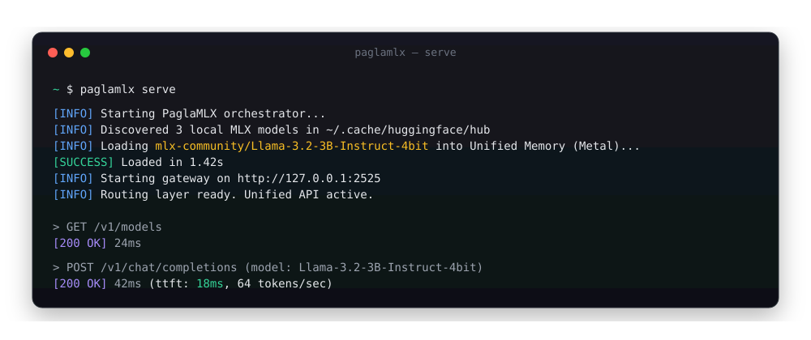

<p align="center">
  <picture>
    
  </picture>
</p>

<h1 align="center">PaglaMLX</h1>
<p align="center"><b>LLM orchestration, optimized for your Mac</b><br>Unified API for local MLX models and cloud providers, managed securely from your menu bar.</p>

<p align="center">
  
  
  
  
  
</p>

<p align="center">
  <a href="https://paglaai.github.io/PaglaMLX/">Docs</a> ·
  <a href="https://paglaai.github.io/PaglaMLX/docs/api-reference/chat-completions">API Reference</a> ·
  <a href="#install">Install</a> ·
  <a href="#quickstart">Quickstart</a> ·
  <a href="#features">Features</a> ·
  <a href="https://github.com/paglaai/PaglaMLX/releases">Releases</a>
</p>

---

<p align="center">
  
</p>

> *Every time I needed to test a local model, I had to spin up isolated servers and manage ports manually. I wanted a smart gateway that unifies local MLX inference with cloud providers, automatically routes requests, and manages the lifecycle of my models right from the menu bar.*
>
> *PaglaMLX does exactly that. It's an orchestration layer that speaks both OpenAI and Anthropic natively, dropping right into any existing AI workflow. That's why we built it.*

## Install

### macOS App (Easiest)

Download the latest `.dmg` from [Releases](https://github.com/paglaai/PaglaMLX/releases), drag to Applications, and you're done. The app provides a native menu bar interface to manage everything.

### From Source

```bash
git clone https://github.com/paglaai/PaglaMLX.git
cd PaglaMLX
./build_dmg.sh          # release build + .app + .dmg
```

Requires macOS 14.0+ (Sonoma), Python 3.12+, and Apple Silicon (M1/M2/M3/M4).

## Quickstart

1. **Set your models directory** — Open Settings → App and point it at a folder of MLX model subdirectories (like `~/.cache/huggingface/hub`).
2. **Check Python** — Settings → Python auto-detects your environment (needs `mlx-lm`, `fastapi`, `uvicorn`, `httpx`).
3. **Load a model** — Pick one from the menu bar and press Play.
4. **Connect clients** — Point any OpenAI/Anthropic-compatible tool at `http://127.0.0.1:2525/v1`, using the key from Settings → Network.

```bash
curl http://127.0.0.1:2525/v1/chat/completions \
  -H "Authorization: Bearer $(defaults read com.paglaai.app apiKey)" \
  -d '{"model":"auto","messages":[{"role":"user","content":"Hello"}]}'
```
> Use `model=auto` to let the Auto-Router decide, or `model=<exact name>` to hit a specific local model.

## Features

Supports local text generation models, cloud fallback routing, and native protocol translation on Apple Silicon.

### Smart Gateway (`:2525/v1`)
- **OpenAI-native**: `/v1/chat/completions`, `/v1/embeddings`, `/v1/models`
- **Anthropic-native**: `/v1/messages`, translated bidirectionally (streaming + tool calls)
- **Auto-Router**: `model=auto` picks the best local model by capability
- **Cloud routing by prefix**: `gpt-*`, `claude-*`, `gemini-*`, `openrouter/*`, `groq/*`, `together/*`
- **Free Router fallback** via OpenRouter

### Model Orchestration
- One-click load/unload from a directory of MLX models
- Each model runs as an isolated `mlx_lm.server` on its own port
- Route table updates live as models start and stop
- Multiple concurrent models, dispatched by name

### One-Click Integrations
- VS Code (Copilot, Kilo Code, OpenCode, Cline), Continue.dev
- Claude Code (VS Code + standalone), Claude Desktop
- OpenCode (standalone + legacy), Codex CLI
- Agent Hermes, OpenClaw, Qwen Code

### Architecture

```
┌─────────────┐     ┌──────────────────────────────┐
│  SwiftUI App │────▶│  RoutingGateway (Python)     │
│  (menu bar)  │     │  :2525  /v1/*                │
└──────┬───────┘     │                              │
       │             │  ┌──────┐ ┌──────┐ ┌──────┐  │
       │ loads       │  │Local │ │Cloud │ │Free  │  │
       ▼             │  │Router│ │Router│ │Router│  │
┌─────────────┐      │  └──┬───┘ └──┬───┘ └──┬───┘  │
│ mlx_lm proc │      │     │        │        │      │
│  per model   │◀────┘     ▼        ▼        ▼      │
│ port 50xx    │        local    OpenAI  OpenRouter  │
└─────────────┘        mlx_lm   Anthropic  Groq      │
                          proc    Gemini   Together   │
```

## Contributing
Contributions are welcome! Please open an issue to discuss changes before submitting a PR.
Bug reports and feature requests: [open an issue](https://github.com/paglaai/PaglaMLX/issues).

## License
MIT — see [LICENSE](LICENSE).

<p align="center">
  <a href="#paglamlx">⬆ back to top</a>
</p>
