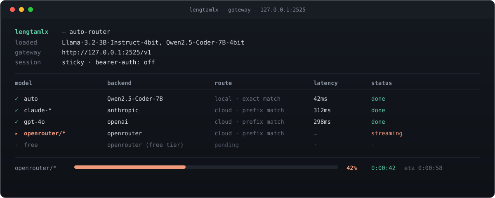

<div align="center">


### Automated model orchestration for your Mac

Point any OpenAI or Anthropic client at `127.0.0.1:2525`. PaglaMLX handles process orchestration, protocol translation, routing, and fallback to cloud providers when you need them.

[](LICENSE)
[](#requirements)
[](#requirements)
[](https://github.com/paglagpt/PaglaMLX/search?l=swift)
[](https://github.com/paglagpt/PaglaMLX/releases)

[Docs](https://paglagpt.github.io/PaglaMLX/) · [API Reference](https://paglagpt.github.io/PaglaMLX/docs/api-reference/chat-completions) · [Releases](https://github.com/paglagpt/PaglaMLX/releases) · [Issues](https://github.com/paglagpt/PaglaMLX/issues)

<br/>



</div>

---

PaglaMLX launches each model as its own server process, keeps a live route table (`~/.lengtamlx/routes.json`), and runs a unified gateway at `127.0.0.1:2525` that speaks **OpenAI** and **Anthropic** formats natively. Any OpenAI/Anthropic-compatible client can connect and start using your local models as if they were cloud APIs — and it falls back to real cloud providers when you ask for one you don't have locally.

> The trace above is a hand-built illustration of real request behavior, not a live screenshot. Swap in an actual terminal capture once you have one — happy to help wire that in.

## Contents

- [Features](#features)
- [Requirements](#requirements)
- [Installation](#installation)
- [Getting started](#getting-started)
- [API reference](#api-reference)
- [Architecture](#architecture)
- [Building from source](#building-from-source)
- [Contributing](#contributing)
- [License](#license)

## Features

<table>
<tr>
<td width="50%" valign="top">

**Model orchestration**
- One-click load/unload from a directory of MLX models
- Each model runs as an isolated `mlx_lm.server` on its own port
- Route table updates live as models start and stop
- Multiple concurrent models, dispatched by name

**Smart gateway (`:2525/v1`)**
- OpenAI-native: `/v1/chat/completions`, `/v1/embeddings`, `/v1/models`
- Anthropic-native: `/v1/messages`, translated bidirectionally (streaming + tool calls)
- Auto-Router: `model=auto` picks the best local model by capability
- Cloud routing by prefix: `gpt-*`, `claude-*`, `gemini-*`, `openrouter/*`, `groq/*`, `together/*`
- Free Router fallback via OpenRouter
- Session stickiness and an optional Bearer-token guard

</td>
<td width="50%" valign="top">

**One-click integrations**
- VS Code (Copilot, Kilo Code, OpenCode, Cline), Continue.dev
- Claude Code (VS Code + standalone), Claude Desktop
- OpenCode (standalone + legacy), Codex CLI
- Agent Hermes, OpenClaw, Qwen Code

**Preflight & safety**
- Validates your Python environment (`mlx_lm`, `fastapi`, `uvicorn`, `httpx`)
- Warns before launch if models live on an external volume
- Detects gateway port conflicts
- Surfaces macOS Jetsam (OOM) memory pressure warnings

**BYOK & presets**
- Bring your own keys for OpenAI, Anthropic, Gemini, OpenRouter, Groq, Together AI
- Save generation parameters as named presets, system prompts as personas
- Custom ChatML templates for fine-tuned models

</td>
</tr>
</table>

## Requirements

- macOS 14.0+ (Sonoma or later)
- Apple Silicon (M1/M2/M3/M4 — MLX requires Metal)
- Python 3.12+ with `mlx_lm`, `fastapi`, `uvicorn`, `httpx`

```bash
pip3 install mlx-lm fastapi uvicorn httpx
```

## Installation

**Download (easiest)**

1. Grab the latest `PaglaMLX.dmg` from [Releases](https://github.com/paglagpt/PaglaMLX/releases).
2. Drag `PaglaMLX.app` to Applications.
3. Open the app.

**Build from source**

```bash
git clone https://github.com/paglagpt/PaglaMLX.git
cd PaglaMLX
./build_dmg.sh          # release build + .app + .dmg
```

Or build and run directly:

```bash
swift build -c release && open .build/release/PaglaMLX
```

## Getting started

1. **Set your models directory** — Settings → App → point at a folder of MLX model subdirectories.
2. **Check Python** — Settings → Python auto-detects your environment.
3. **Load a model** — pick one from the menu bar and press Play.
4. **Connect your clients** — point any OpenAI/Anthropic-compatible tool at `http://127.0.0.1:2525/v1`, using the key from Settings → Network.
5. **One-click integrations** — Settings → Integrations → Apply.

```bash
curl http://127.0.0.1:2525/v1/chat/completions \
  -H "Authorization: Bearer $(defaults read com.lengtamlx.app apiKey)" \
  -d '{"model":"auto","messages":[{"role":"user","content":"Hello"}]}'
```

> Use `model=auto` to let the Auto-Router decide, or `model=<exact name>` to hit a specific local model.

## API reference

Full parameter tables, request/response shapes, and streaming formats live in the [docs site](https://paglagpt.github.io/PaglaMLX/docs/api-reference/chat-completions). Quick summary:

| Endpoint | Description |
|---|---|
| `GET /v1` | Gateway health check |
| `GET /v1/models` | Lists loaded local models |
| `POST /v1/chat/completions` | Chat completion (OpenAI format) |
| `POST /v1/embeddings` | Embeddings, when supported |
| `POST /v1/messages` | Messages API (Anthropic format), translated to/from OpenAI |

**Routing** — the gateway checks, in order: local exact match → local substring match → cloud prefix (`gpt-*` → OpenAI, `claude-*` → Anthropic, `gemini-*` → Gemini, `openrouter/*`, `groq/*`, `together/*`) → Free Router → session stickiness → first local model → `503`.

## Architecture

```
┌─────────────┐     ┌──────────────────────────────┐
│  SwiftUI App │────▶│  RoutingGateway (Python)     │
│  (menu bar)  │     │  :2525  /v1/*                │
└──────┬───────┘     │                              │
       │             │  ┌──────┐ ┌──────┐ ┌──────┐  │
       │ loads       │  │Local │ │Cloud │ │Free  │  │
       ▼             │  │Router│ │Router│ │Router│  │
┌─────────────┐      │  └──┬───┘ └──┬───┘ └──┬───┘  │
│ mlx_lm proc │      │     │        │        │      │
│  per model   │◀────┘     ▼        ▼        ▼      │
│ port 50xx    │        local    OpenAI  OpenRouter  │
└─────────────┘        mlx_lm   Anthropic  Groq      │
                          proc    Gemini   Together   │
```

- **ModelOrchestrator** starts/stops `mlx_lm.server` processes and writes the route map.
- **RoutingGateway** reads the route map, dispatches requests, and handles protocol translation.
- **IntegrationManager** patches third-party config files to point at the gateway.
- **TunnelManager** (optional) opens a public `trycloudflare.com` tunnel for remote access.

## Building from source

```bash
git clone https://github.com/paglagpt/PaglaMLX.git
cd PaglaMLX
swift build -c release
```

`build_dmg.sh` automates: release build → `.app` bundle → ad-hoc signing → DMG packaging (with an `/Applications` symlink for drag-and-drop install).

Open in Xcode with `open Package.swift`.

## Contributing

Contributions are welcome — please open an issue to discuss changes before submitting a PR.

1. Fork the repository
2. Create a feature branch (`git checkout -b feat/my-change`)
3. Commit your changes (`git commit -am 'Add my feature'`)
4. Push the branch (`git push origin feat/my-change`)
5. Open a Pull Request

Bug reports and feature requests: [open an issue](https://github.com/paglagpt/PaglaMLX/issues).

## License

MIT — see [LICENSE](LICENSE).

<div align="center">

[⬆ back to top](#lengtamlx)

</div>
